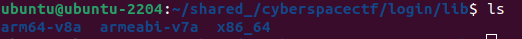
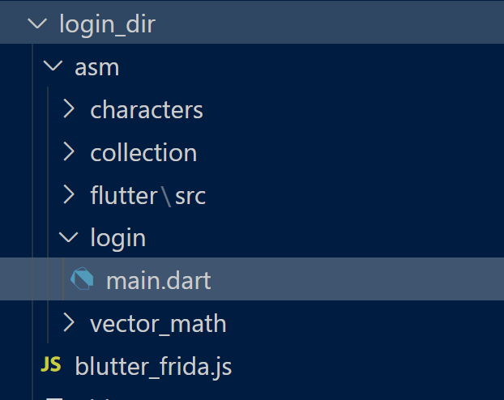
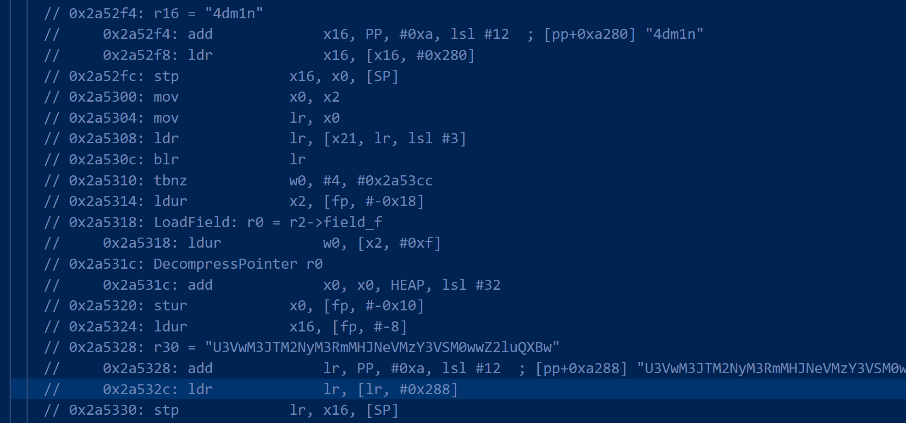
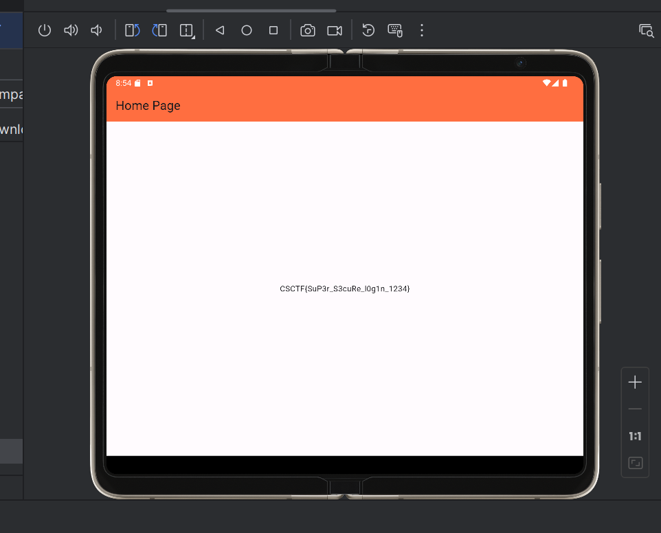

# login

We are given a login.apk file, where we must login to get the flag.

First, I unzipped the apk file to get the contents.

`unzip -d login login.apk`

Then, I decided to use jd-gui to look at the decompiled .class files. Looking at the library names, I found out that it was a flutter application.

After looking on the internet for flutter reverse engineering tips, , Flutter applications don't have their main logic in the .class files like normal java apks. The main logic is contained in `/lib/<platform>/libapp.so`.

The `libapp.so` is a VM snapshot, and I needed to find a tool to extract the information from this VM snapshot.

I chose this tool: [blutter](https://github.com/worawit/blutter) since it is compatible with the dart version of this apk (v3.3.0), but there are also other popular tools, such as: [reflutter](https://github.com/ptswarm/reFlutter).

I ran the following: `python3 blutter.py <indir> <outdir>`.

These were the resulting files I got:

After looking around in main.dart, I noticed the username and base64 encoded password in the file:

The username was `4dm1n`, and the decoded password was `Sup3rS3cr3tf0rMyS3cuR3L0ginApp`.

Afterwards, I ran the apk in Android Studio, logged in with the username and password, and obtained the flag!

This was my first flutter reversing challenge, and I really learned a lot!

## References:

- [Reversing an Android sample which uses Flutter](https://cryptax.medium.com/reversing-an-android-sample-which-uses-flutter-23c3ff04b847)
- [Reflutter](https://github.com/ptswarm/reFlutter)
- [blutter](https://github.com/worawit/blutter)
