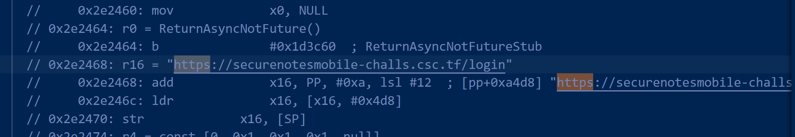
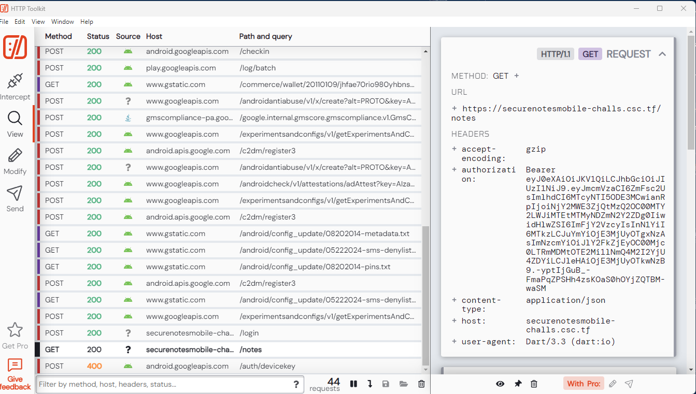

# securenotes

I didn't solve this challenge. However, I did learn a lot from trying, so I decided to still do a writeup to document what I learned.

Following [login](login.md), I decided to try this challenge since I already downloaded most of the tools I needed to solve flutter reversing challenges.

First, I ran the apk in Android studio, and it was an app where users could register, login, and create their own notes.

As before, I unzipped and applied blutter on the `libapp.so` image.

This time, I found some interesting endpoints in the disassembled code.

It turned out that the application was sending JSON data to the endpoints for communication.
I could also tell that the endpoint was sending back a bearer token during the login process. 

To inspect the network, I used [Http Toolkit](https://httptoolkit.com/). It allowed me to connect to the Android Studio emulator and inspect the packets. 

Choose to use ADB:

I struggled a bit with this since my initial device used a Google Play System image, which does not allow rooting of the device. Only system images that can be rooted would allow us to do network inspection. So I chose an Pixel 6 Pro and tried again.

This is what a successful connection looks like. System trust enabled should be allowed for apps to trust the Http toolkit certificate.

I got the bearer token from Http Toolkit.

This was as far as I got in the challenge. I later learned that the token was a weak JWT token, which could be bruteforced to get the secret key. Then, we could to forge the admin's token to login.

## References

- [Decrypting HTTPS traffic on Android the easiest way](https://jamesmacwhite.medium.com/decrypting-https-traffic-on-android-the-easiest-way-f2e9caf42416)
