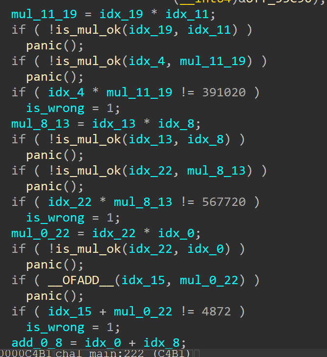

# sole

This was my first time reversing a rust binary and I had some help from a new friend with solving it!

Upon running the binary, it appeared to be a classical challenge where we had to input a secret string to the program.

After looking around in IDA, it became clear that the main logic was was in the function: chall::main.

At first, a comparison with 26 was done, which gave me the info that the string was probably 26 in length.

In the middle, there were a bunch of functions, which initially I skipped.
And in the bottom, there were a bunch of addition, subtraction, multiplications done.




It turned out that these functions in the middle were just indexing into the string I provided:


By labeling them with their indexes, I could tell which element in the string was used in the equations.

All the equations:
```
idx_4 * idx_11 * idx_19 = 391020
idx_8 * idx_13 * idx_22 = 567720
idx_22 * idx_0 + idx_15 = 4872
idx_0 + idx_8 + idx_11 = 199
idx_13 - idx_22 * idx_12 = -3721
idx_9 * idx_4 - idx_1 = 8037
idx_9 * idx_16 * idx_11 = 272832
idx_3 * idx_23 + idx_15 = 9792
idx_9 - idx_23 - idx_4 = -70
idx_5 - idx_21 - idx_8 = -63
idx_24 * idx_3 + idx_0 = 5359
idx_25 * idx_1 + idx_17 = 10483
idx_7 * idx_19 * idx_2 = 893646
idx_11 - idx_4 + idx_19 = 93
idx_7 + idx_6 - idx_10 = 136
idx_0 + idx_25 + idx_10 = 287
idx_12 + idx_5 - idx_22 = 104
idx_4 * idx_7 + idx_12 = 8243
idx_1 - idx_22 + idx_4 = 81
idx_8 - (idx_19 * idx_11) = -5503
idx_8 - idx_10 - idx_7 = -129
idx_20 + idx_22 + idx_21 = 224
idx_24 + idx_23 + idx_12 = 232
idx_15 - idx_9 + idx_4 = 2
idx_9 * idx_15 + idx_2 = 5635
idx_24 + idx_14 + idx_16 = 210
idx_1 + idx_10 - idx_12 = 125
idx_18 - idx_1 - idx_5 = -111
idx_12 - idx_14 - idx_7 = -163
idx_1 + idx_5 - idx_16 = 158
```

Afterwards, the equations could be solved by using [Z3](https://github.com/Z3Prover/z3). This was the [script](sole.py)

And we can get the final flag: `CSCTF{ruSt_15_c00l_r1gHt?}`