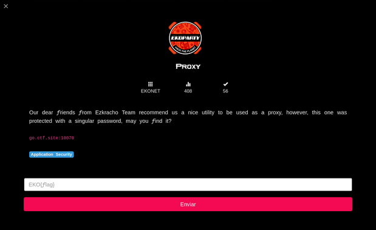

# Proxy



By digging around the site, I found the `bnc.c` file.
We need to go through the source code to find the flag:

```
 92     bzero(gethost, 100);
 93     read(source, gethost, 100);
 94     sprintf(string, "");
 95     write(source, string, strlen(string));
 96     read(source, gethost, 100);
 97     gethost[(strlen(gethost)-2)] = '\0'; /* kludge alert - kill the \r\n */
 98     if (strcmp(gethost, "EKO{vuduownsyou}") != 0) {
 99         close(source);
100         exit(0);
101     }
102     do {
103                 found = 0;
104                 bzero(gethost,100);

```

Flag: EKO{vuduownsyou}